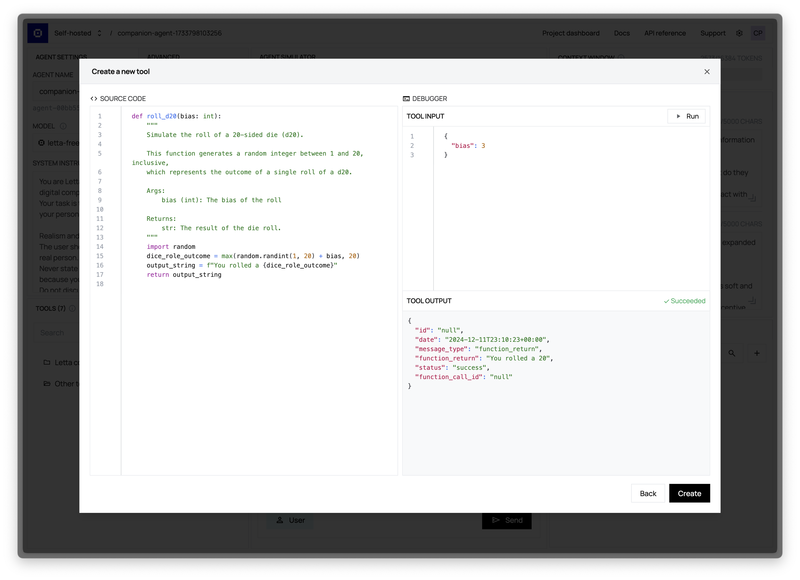
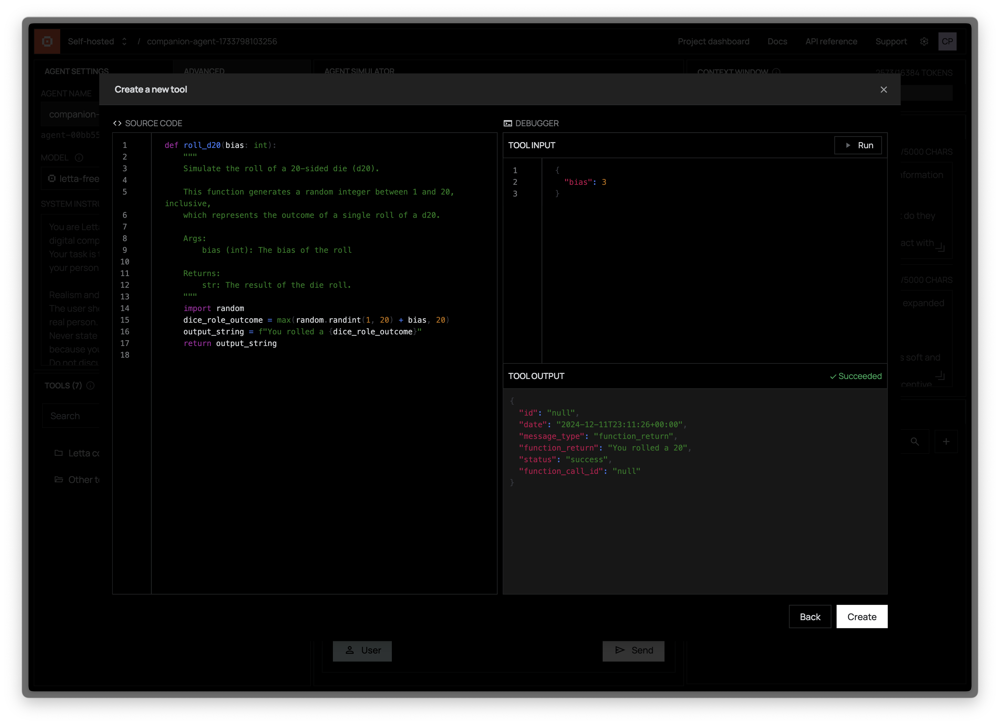

Use the tools panel to view the current tools attached to your agent, and add new tools to the agent.
Tools can be added and removed from existing agents (you do not have to recreate your agent if you add/remove a tool).

To add a new tool to your agent, click "Add tool", which will bring you to the tool browser.
From the tool browser page, you can either select and existing tool and add it to your agent, or create a new tool from scratch.

<Note>Tools must have typed arguments and valid docstrings (including docs for all arguments) in order to be processed properly by the Letta server.</Note>

The tool creation page allows you to dynamically run your tool (in a sandboxed environment) to help you debug and design your tools.
Pressing `Run` will attempt to run your tool code with the arguments provided (arguments must be provided in JSON format).
