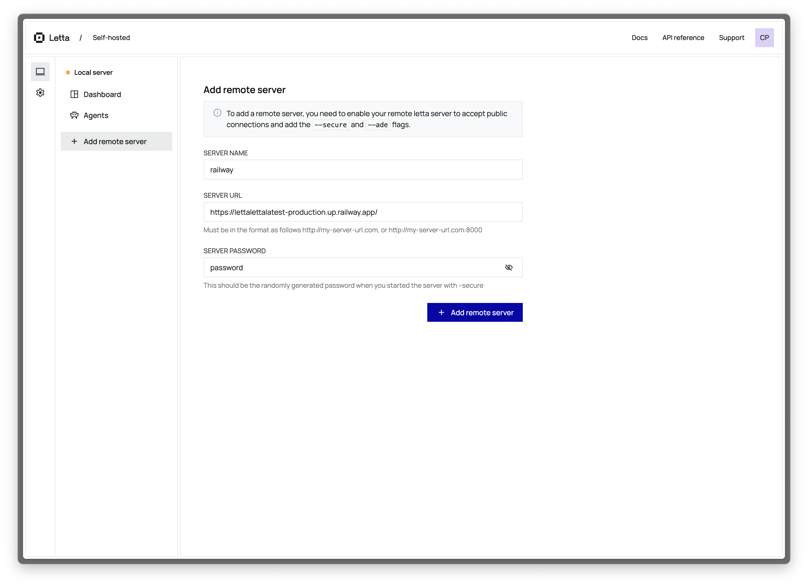
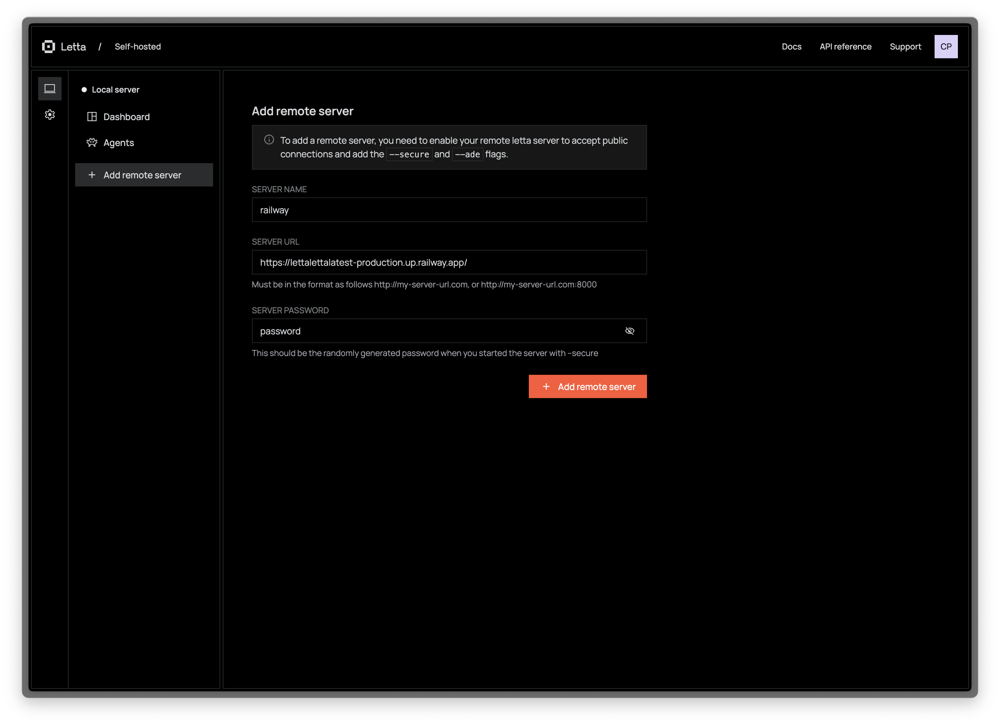

<Tip>
The ADE is currently in open beta.
During the beta period, you can access the ADE at [https://app.letta.com](https://app.letta.com) and connect it to your local Letta server or self-hosted deployments.
</Tip>

<Frame>
<iframe width="560" height="315" src="https://www.youtube.com/embed/OzSCFR0Lp5s?si=pyJMo7eKBcW2zaan" title="YouTube video player" frameborder="0" allow="accelerometer; autoplay; clipboard-write; encrypted-media; gyroscope; picture-in-picture; web-share" referrerpolicy="strict-origin-when-cross-origin" allowfullscreen></iframe>
</Frame>

The ADE can connect to self-hosted Letta servers (e.g. a Letta server running on your laptop), as well as the Letta Cloud service.
When connected to a self-hosted / private server, the ADE uses the Letta REST API to communicate with your server.

## Connecting to a local server
To connect the ADE with your local Letta server, simply:
1. Start your Letta server (`docker run ...`)
2. Visit [https://app.letta.com](https://app.letta.com) and you will see "Local server" as an option in the left panel

## 🌐 Connecting to an external (self-hosted) server
If your Letta server isn't running on `localhost` (for example, you deployed it on an external service like EC2):
1. Click "Add remote server"
2. Enter your desired server name, the IP address of the server, and the server password (if set, otherwise leave empty)

