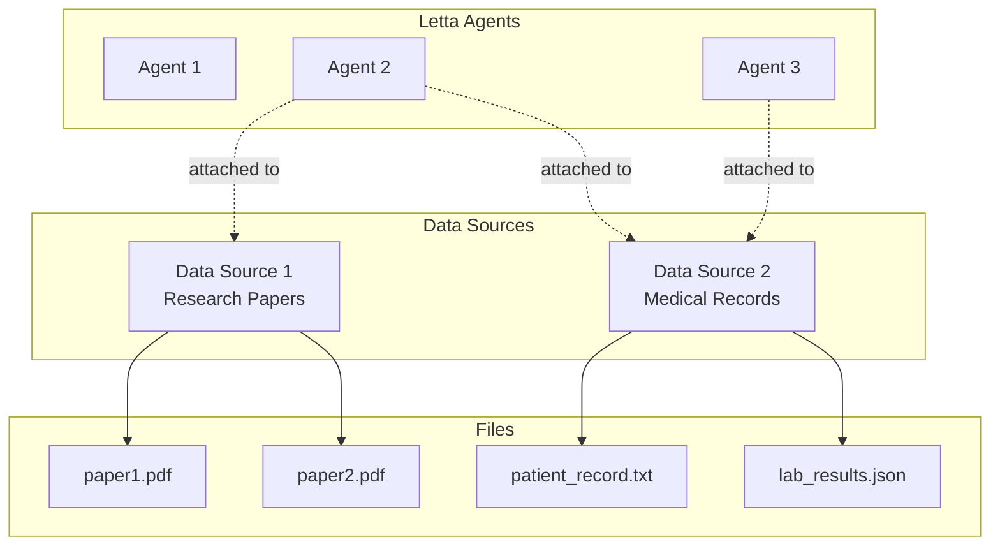

Data sources allow you to easily connect your agents to external files, for example: research papers, reports, medical records, or any other data in common text formats (`.pdf`, `.txt`, `.md`, `.json`, etc.).
A data source can consist of many files, which can be uploaded via the ADE or API.



Once a file has been uploaded to a data source, the agent can access it using a set of **file tools**.
The file is automatically chunked and embedded to allow the agent to use semantic search to find relevant information in the file (in addition to standard text-based search).

<Tip>
If you've used [Claude Projects](https://www.anthropic.com/news/projects) before, you can think of a **data source** in Letta as a "project", except in Letta you can connect a single agent to multiple projects (in Claude Projects, a chat session can only be associated with a single project).
</Tip>

## File tools

When a data source is attached to an agent, Letta automatically attaches a set of file tools to the agent:
* `open_file`: Open a file to a specific location
* `grep_file`: Search a file using a regular expression
* `search_file`: Search a file using semantic (embedding-based) search

To detach these tools from your agent, simply detach all your data sources, the file tools will be automatically removed.

## Creating a data source

### ADE

To create a data source click the "data sources" tab in the bottom-left of the ADE, then click the "create data source" button. When you create a data source inside the ADE, it will be automatically attached to your agent.

### API / SDK

To create a data source, you will need to specify a unique `name` as well as an `EmbeddingConfig`:
<CodeGroup>
```python title="python"
# get an available embedding_config
embedding_configs = client.embedding_models.list()
embedding_config = embedding_configs[0]

# create the source
source = client.sources.create(
    name="my_source",
    embedding_config=embedding_config
)
```
```typescript title="node.js"
// get an available embedding_config
const embeddingConfigs = await client.embeddingModels.list()
const embeddingConfig = embeddingConfigs[0];

// create the source
const source = await client.sources.create({
    name: "my_source",
    embeddingConfig: embeddingConfig
});
```
</CodeGroup>
Now that you've created the source, you can start loading data into the source.

## Uploading a file into a data source

### ADE

Click the "data sources" tab in the bottom-left of the ADE to view your attached data sources.
To upload a file, simply drag and drop the file into the data sources tab, or click the upload (+) button.

### API / SDK

Uploading a file to a source will create an async job for processing the file, which will split the file into chunks and embed them.
<CodeGroup>
```python title="python"
# upload a file into the source
job = client.sources.files.upload(
    source_id=source.id,
    file=open("my_file.txt", "rb")
)

# wait until the job is completed
while True:
    job = client.jobs.retrieve(job.id)
    if job.status == "completed":
        break
    elif job.status == "failed":
        raise ValueError(f"Job failed: {job.metadata}")
    print(f"Job status: {job.status}")
    time.sleep(1)
```
```typescript title="node.js"
// upload a file into the source
const uploadJob = await client.sources.files.upload(
    createReadStream("my_file.txt"),
    source.id,
);
console.log("file uploaded")

// wait until the job is completed
while (true) {
    const job = await client.jobs.retrieve(uploadJob.id);
    if (job.status === "completed") {
        break;
    } else if (job.status === "failed") {
        throw new Error(`Job failed: ${job.metadata}`);
    }
    console.log(`Job status: ${job.status}`);
    await new Promise((resolve) => setTimeout(resolve, 1000));
}
```
</CodeGroup>
Once the job is completed, you can list the files and the generated passages in the source:
<CodeGroup>
```python title="python"
# list files in the source
files = client.sources.files.list(source_id=source.id)
print(f"Files in source: {files}")

# list passages in the source
passages = client.sources.passages.list(source_id=source.id)
print(f"Passages in source: {passages}")
```
```typescript title="node.js"
// list files in the source
const files = await client.sources.files.list(source.id);
console.log(`Files in source: ${files}`);

// list passages in the source
const passages = await client.sources.passages.list(source.id);
console.log(`Passages in source: ${passages}`);
```
</CodeGroup>

## Listing available data sources
You can view available data sources by listing them:
<CodeGroup>
```python title="python"
# list sources
sources = client.sources.list()
```
```typescript title="node.js"
// list sources
const sources = await client.sources.list();
```
</CodeGroup>

## Connecting a data source to an agent

When you attach a data source to an agent, the files inside the data source will become visible inside the agent's context window.
By default, only a limited "window" of the file will be visible to prevent context window overflow - the agent can use the file tools to browse through the files and search for information.

## Attaching the data source

### ADE

When you create a data source inside the ADE, it will be automatically attached to your agent.
You can also attach existing data sources by clicking the "attach existing" button in the data sources tab.

### API / SDK

You can attach a source to an agent by specifying both the source and agent IDs:
<CodeGroup>
```python title="python"
client.agents.sources.attach(agent_id=agent.id, source_id=source.id)
```
```typescript title="node.js"
await client.agents.sources.attach(agent.id, source.id);
```
</CodeGroup>
Note that your agent and source must be configured with the same embedding model, to ensure that the agent is able to search accross a common embedding space for archival memory.

## Detaching the data source

### ADE

To detach a data source from an agent, click the "detach" button in the data sources tab.

### API / SDK

Detaching a data source will remove the files from the agent's context window:
<CodeGroup>
```python title="python"
client.agents.sources.detach(agent_id=agent.id, source_id=source.id)
```
```typescript title="node.js"
await client.agents.sources.detach(agent.id, source.id);
```
</CodeGroup>
