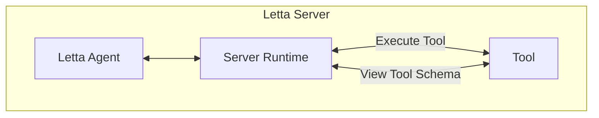
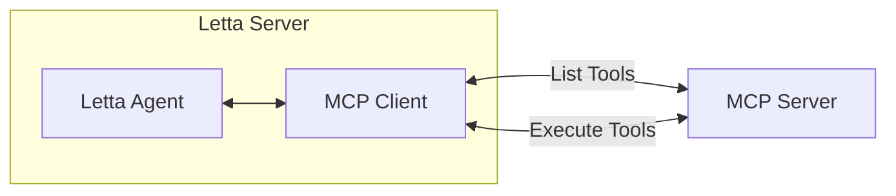
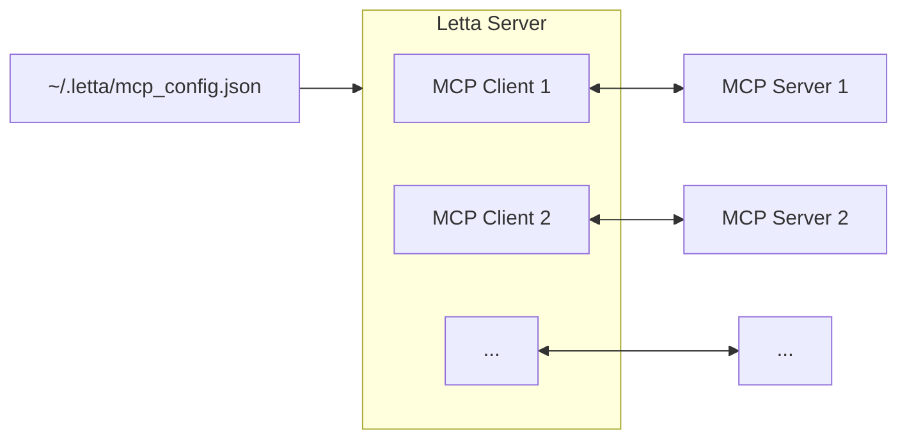
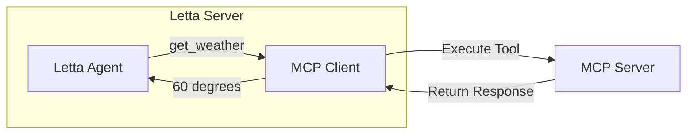

<Tip>
Model Context Protocol (MCP) is a framework for connecting LLMs to tools and data, developed by [Anthropic](https://www.anthropic.com).
To learn more about MCP, visit their [documentation site](https://modelcontextprotocol.io).
</Tip>

**Already know what an MCP server is?** Jump to the [configuration instructions](#connecting-letta-to-mcp-servers).


## What is an "MCP server"?

Developers can create **MCP servers** to give LLMs / LLM agents an easy way to view and execute tools (to use the MCP server, the agent framework must support acting as an "MCP client").
For example, a developer can create an MCP server for getting the weather using an API service.

When using MCP for tools, the MCP server needs to implement two key functionalities:
1. List the available tools (e.g. `get_weather` and `get_alerts`) and provide the JSON schemas for the tools (which tell the agent how to call the tools)
2. Handle the actual invocation of the tools, given the input arguments generated by the agent

**MCP clients** (like Letta) can then ask this server to list the available tools and execute them.

Simply put, the Letta MCP integration is another means to connect your Letta agents to more tools. More optionality through the power of open source!

## How do regular tools work?



In Letta, the agent can see the available tools as JSON schemas.
When the agent wants to invoke a tool, the agent provides the input arguments to a tool.
The Letta runtime then takes the input arguments from the agent, and attempts to run the tool - if tool execution succeeds, the agent receives the output from the tool, and if the tool fails, the agent receives the output of the error. Because the agent receives an error if the tool execution fails, it allows the agent to attempt to recover from its mistake by trying again.

## How do MCP tools work?



### MCP tool visibility

When the Letta server starts, it reads from the `~/.letta/mcp_config.json` file and attempts to connect to each MCP server listed in the config. If the connection is successful, the Letta server polls the MCP server for a list of tools.



These tools are shown in the ADE editor (where they can also by attached to agents). MCP tools (that were found during Letta server startup) can be attached using the MCP-specific Letta API routes.

### MCP tool execution

With MCP tools in Letta, the tool execution is not handled by the Letta server - instead, the tool execution happens on the MCP server.



This is similar to what happens when you use tool sandboxing (the tool is executed in a sandbox) or when you use Composio tools (the tool is executed on Composio's servers) - with MCP, the tool is always executed by the MCP server.

## Connecting Letta to MCP servers

To connect Letta to MCP servers, you need to edit the `~/.letta/mcp_config.json` file.
If the file doesn't exist, you can create it with an initial empty state:
```json
{
  "mcpServers": {}
}
```

The basic structure of the file is `mcpServers` at the top level - which is a dictionary of MCP server configurations. Local MCP servers can be configured with `command` (required - the command to start the server), `args` (optional extra args to the command), and `env` (optional extra env vars for the server).

If you've already used MCP with Claude Desktop, you can copy the configuration from your Claude MCP JSON config into your `~/.letta/mcp_config.json` file.

See the examples below to understand how to set your `~/.letta/mcp_config.json` file.

## Local MCP servers

The primary way to use MCP is to install an MCP server locally - see the [MCP example server GitHub repo](https://github.com/modelcontextprotocol/servers) for a list of example MCP servers.

### Example: connecting Letta to the Perplexity MCP server

[Perplexity](https://www.perplexity.ai/) (the AI search company) has an official MCP server on [GitHub](https://github.com/ppl-ai/modelcontextprotocol) that enables agents to use Perplexity to search the web.

To set their MCP server up with Letta, we first need to install the Perplexity MCP server locally. This requires a few steps (see their [README](https://github.com/ppl-ai/modelcontextprotocol) for the full instructions):
1. Clone the Perplexity MCP repo
2. Install it with `npm install`
3. Get a Sonar API key
4. Build the MCP server Docker image

Once we've installed the Perplexity MCP server, we need to modify our `~/.letta/mcp_config.json` file so that the Letta server will attempt to connect to it on startup:
```json
{
  "mcpServers": {
    "perplexity-ask": {
      "command": "docker",
      "args": [
        "run",
        "-i",
        "--rm",
        "-e",
        "PERPLEXITY_API_KEY",
        "mcp/perplexity-ask"
      ],
      "env": {
        "PERPLEXITY_API_KEY": "YOUR_API_KEY_HERE"
      }
    }
  }
}
```

The format of the JSON is taken directly from the Perplexity MCP server's README (it's the same as setting up the MCP server for use with Claude Desktop).
The contents of the config tell the MCP client (Letta) how to start the MCP server (using the `command`, `args`, and `env`).

Note that you **do not** have to start the MCP server separately from the Letta server - because the Letta server is an MCP client, it will automatically start the server using the provided `command` and `args`. This is different from a "remote (SSE) MCP server", where the MCP client assumes the server is already running (see below).

## Remote MCP servers

<Warning>
Remote MCP servers are not officially supported by the MCP protocol (see the [MCP roadmap](https://github.com/modelcontextprotocol/specification/discussions/102) for more details).

The current mechanism for using "remote MCP servers" is to use an unauthenticated URL - meaning that anyone with the URL is able to use the tools on the MCP server (**so be careful not to share/expose your URL**).
</Warning>

Connecting to a remote MCP server is as simple as adding the URL to your `~/.letta/mcp_config.json` file.
For example, if you have the URL of an MCP server that looks like `https://mcp-server-123456.externaldomain.com`, simply add it to your `~/.letta/mcp_config.json` file like so:
```json
{
  "mcpServers": {
    "myRemoteServerName": {
      "url": "https://mcp-server-123456.externaldomain.com"
    }
  }
}
```

You can combine both local and remote MCP servers in the same `~/.letta/mcp_config.json` file, for example:
```json maxLines=50
{
  "mcpServers": {
    "perplexity-ask": {
      "command": "docker",
      "args": [
        "run",
        "-i",
        "--rm",
        "-e",
        "PERPLEXITY_API_KEY",
        "mcp/perplexity-ask"
      ],
      "env": {
        "PERPLEXITY_API_KEY": "YOUR_API_KEY_HERE"
      }
    },
    "myRemoteServerName": {
      "url": "https://mcp-server-123456.externaldomain.com"
    }
  }
}
```
