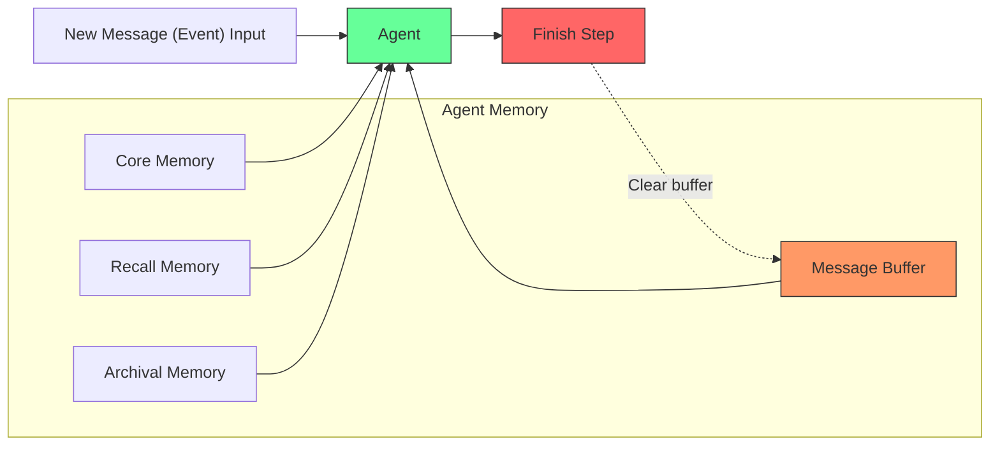

Letta agents have programmable in-context memory. This means a section of the context window is reserved for editable memory: context that can be edited by memory editing tools. Like standard system prompts, the memory also can be used to define the behavior of the agent and store personalization data. The key distinction is that this data can be modified over time.

## Memory
The in-context (i.e. core) memory of agents is represented by a `Memory` object. This object contains:
* A set of `Block` objects representing a segment of memory, with an associated character limit and label
* A set of memory editing tools

## Agent Core Memory
The core memory of an agent is a set of blocks, with an associated character limit, label, and value. The value is stored in the agent's context window, so that information is always provided to the LLM.

### Blocks
Blocks are the basic unit of core memory. A set of blocks makes up the core memory. Each block has:
* A `limit`, corresponding to the character limit of the block (i.e. how many characters in the context window can be used up by this block)
* A `value`, corresponding to the data represented in the context window for this block
* A `label`, corresponding to the type of data represented in the block (e.g. `human`, `persona`)


### Creating agents with memory

```python
from letta_client import Letta

client = Letta(base_url="http://localhost:8283")

agent = client.agents.create(
    name="memory_agent",
    memory_blocks=[
        {"label": "persona", "value": "I am a memory agent"},
        {"label": "human", "value": "Name: Bob", "limit": 10000},
    ],
    model="anthropic/claude-3-5-sonnet-20241022",
    embedding="openai/text-embedding-ada-002",
    tags=["worker"],
)
```


## Shared Memory
You can create blocks independently of agents. This allows for multiple agents to be *attached* to a block. This allows of synchronized context windows accross agents, enabling shared memory.
```python maxLines=50
# create a persisted block, which can be attached to agents
block = client.blocks.create(
    label="organization",
    value="Organization: Letta",
    limit=4000,
)

# create an agent with both a shared block and its own blocks
shared_block_agent1 = client.agents.create(
    name="shared_block_agent1",
    memory_blocks=[
        {"label": "persona", "value": "I am agent 1"},
    ],
    block_ids=[block.id],
    model="anthropic/claude-3-5-sonnet-20241022",
    embedding="openai/text-embedding-ada-002",
)
# create another agent sharing the block
shared_block_agent2 = client.agents.create(
    name="shared_block_agent2",
    memory_blocks=[
        {"label": "persona", "value": "I am agent 2"},
    ],
    block_ids=[block.id],
    model="anthropic/claude-3-5-sonnet-20241022",
    embedding="openai/text-embedding-ada-002",
)
```

## Stateful Workflows (advanced)
In some advanced usecases, you may want your agent to have persistent memory while not retaining conversation history.
For example, if you are using a Letta agent as a "workflow" that's run many times across many different users, you may not want to keep the conversation or event history inside of the message buffer.

You can create a stateful agent that does not retain conversation (event) history (i.e. a "stateful workflow") by setting the `message_buffer_autoclear` flag to `true` during [agent creation](/api-reference/agents/create). If set to `true` (default `false`), the message history will not be persisted in-context between requests (though the agent will still have access to core, archival, and recall memory).


