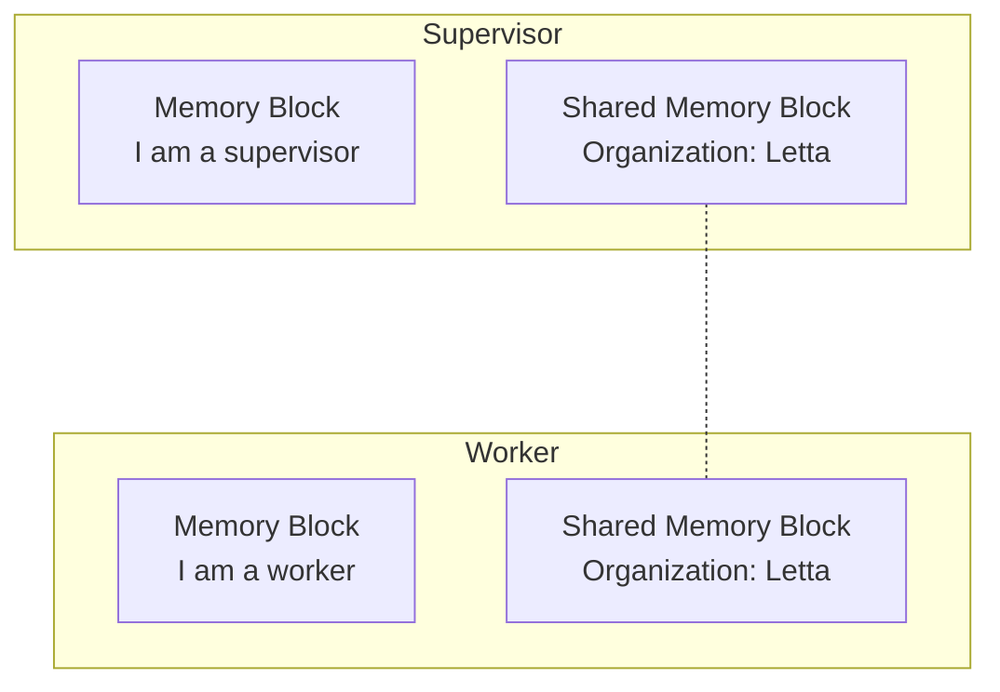

Agents can share state via shared memory blocks.
This allows agents to have a "shared memory".
You can shared blocks between agents by attaching the same block ID to multiple agents.



In the example code below, we create a shared memory block and attach it to a supervisor agent and a worker agent.
Because the memory block is shared, when one agent writes to it, the other agent can read the updates immediately.
```python title="python" maxLines=50
from letta_client import Letta

client = Letta(base_url="http://127.0.0.1:8283")

# create a shared memory block
shared_block = client.blocks.create(label="organization", value="Organization: Letta")

# create a supervisor agent
supervisor_agent = client.agents.create(
    model="anthropic/claude-3-5-sonnet-20241022",
    embedding="openai/text-embedding-ada-002",
    # blocks created for this agentj
    memory_blocks=[{"persona": "I am a supervisor"}],
    # pre-existing shared block that is "attached" to this agent
    block_ids=[shared_block.id],
)

# create a worker agent
worker_agent = client.agents.create(
    model="anthropic/claude-3-5-sonnet-20241022",
    embedding="openai/text-embedding-ada-002",
    # blocks created for this agent
    memory_blocks=[{"persona": "I am a worker"}],
    # pre-existing shared block that is "attached" to this agent
    block_ids=[shared_block.id],
)
```

Memory blocks can also be accessed by other agents, even if not shared.
For example, worker agents can write the output of their task to a memory block, which is then read by a supervisor agent.
To access the memory blocks of other agents, you can simply use the SDK clients or API to access specific agent's memory blocks (using the [core memory routes](/api-reference/agents/core-memory)).
