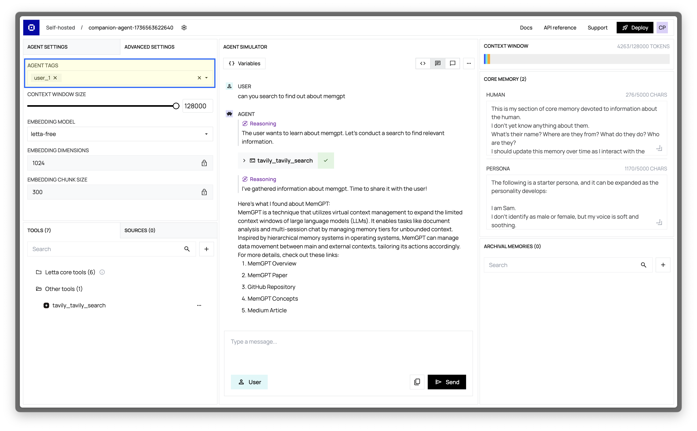

You may be building a multi-user application with Letta, in which each user is associated with a specific agent.
In this scenario, you can use the notion of **tags** (part of the agent state) to associate each agent with a user in your application.

## Using Agent Tags to Identify Users
Let's assume that you have an application with multiple users that you're building on a [self-hosted Letta Server](/guides/server/docker) or [Letta Cloud](/guides/cloud).
Each user has a unique username, starting at `user_1`, and incrementing up as you add more users to the platform.

To associate agents you create in Letta with your users, you can specify a **tag** when creating an agent, and set the tag to the user's unique ID.
For example, with `user_1`, we would set the `tags` parameter to `["user_1"]` in our [create agent request](/api-reference/agents/create):
<CodeBlocks>
```curl title="curl"
curl -X POST https://app.letta.com/v1/agents/ \
     -H "Authorization: Bearer <token>" \
     -H "Content-Type: application/json" \
     -d '{
  "memory_blocks": [],
  "llm": "anthropic/claude-3-5-sonnet-20241022",
  "context_window_limit": 200000,
  "embedding": "openai/text-embedding-ada-002",
  "tags": ["user_1"]
}'
```
```python title="python"
# assumes that you already instantiated a client
agent = client.agents.create(
    memory_blocks=[],
    model="anthropic/claude-3-5-sonnet-20241022",
    context_window_limit=200000,
    embedding="openai/text-embedding-ada-002",
    tags=["user_1"]
)
```

```typescript title="node.js"
// assumes that you already instantiated a client
await client.agents.create({
    memory_blocks: [],
    llm: "anthropic/claude-3-5-sonnet-20241022",
    context_window_limit: 200000,
    embedding: "openai/text-embedding-ada-002",
    tags: ["user_1"]
});
```
</CodeBlocks>

Then, if I wanted to search for agents associated with a specific user (e.g. called `user_id`), I could use the `tags` parameter in the [list agents request](/api-reference/agents/list):
<CodeBlocks>
```curl title="curl"
curl -X GET "https://app.letta.com/v1/agents/?tags=user_1" \
  -H "Accept: application/json"
```
```python title="python"
# assumes that you already instantiated a client
user_agents = client.agents.list(
    tags=["user_1"]
)
```
```typescript title="node.js"
// assumes that you already instantiated a client
await client.agents.list({
    tags: ["user_1"]
});
```
</CodeBlocks>

### Full example using the Python SDK
In this example we'll create an agent with a (user) tag, then search for all agents with that tag.
This example assumes that you have a self-hosted Letta Server running on localhost (for example, by running [`docker run ...`](/guides/server/docker)).
<Accordion title="View example Python SDK code">
```python title="python"
from letta_client import Letta

# in this example we'll connect to a self-hosted Letta Server
client = Letta(base_url="http://localhost:8283")
user_id = "my_uuid"

# create an agent with the user_id tag
agent = client.agents.create(
    memory_blocks=[],
    model="anthropic/claude-3-5-sonnet-20241022",
    context_window_limit=200000,
    embedding="openai/text-embedding-ada-002",
    tags=[user_id]
)
print(f"Created agent with id {agent.id}, tags {agent.tags}")

# list agents
user_agents = client.agents.list(tags=[user_id])
agent_ids = [agent.id for agent in user_agents]
print(f"Found matching agents {agent_ids}")
```
</Accordion>

## Creating and Viewing Tags in the ADE
You can also modify tags in the ADE.
Simply click the **Advanced Settings** tab in the top-left of the ADE to view an agent's tags.
You can create new tags by typing the tag name in the input field and hitting enter.

