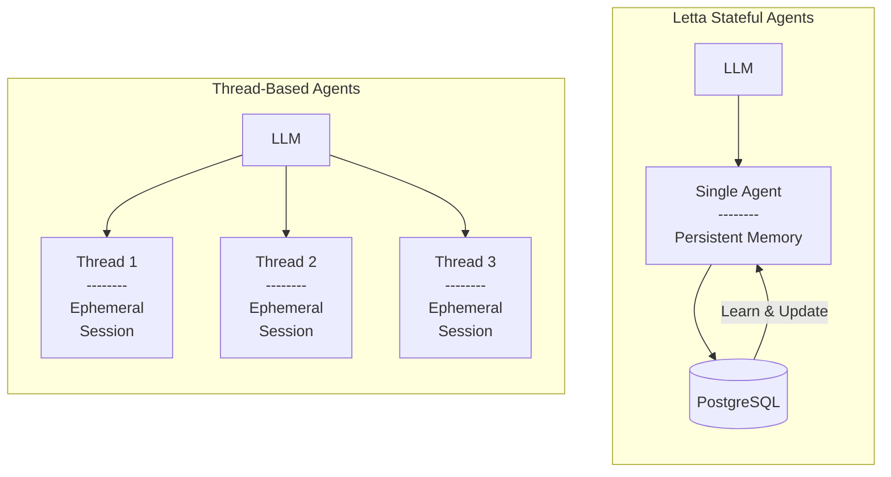

<iframe
  width="560"
  height="315"
  src="https://www.youtube.com/embed/urETleko4Sc"
  title="YouTube video player"
  frameborder="0"
  allow="accelerometer; autoplay; clipboard-write; encrypted-media; gyroscope; picture-in-picture"
  allowfullscreen
></iframe>

Letta agents can automatically manage long-term memory, load data from external sources, and call custom tools.
Unlike in other frameworks, Letta agents are stateful, so they keep track of historical interactions and reserve part of their context to read and write memories which evolve over time.

Key features:
* Python/TypeScript SDKs & REST API
* Persistence
* Tool calling (support for custom tools & Composio tools)
* Memory management
* Deployment
* Streaming support

Letta manages a reasoning loop for agents. At each agent step (i.e. iteration of the loop), the state of the agent is checkpointed and persisted to the database.

You can interact with agents from a REST API, the ADE, and TypeScript / Python SDKs.
As long as they are connected to the same service, all of these interfaces can be used to interact with the same agents.

## Agents vs Threads

In Letta, can you can think of an agent as a single entity that has a single message history which is treated as infinite.
The sequence of interactions the agent has experienced through its existence make up the agent's state (or memory).

One distinction between Letta and other agent frameworks is that Letta does not have the notion of message *threads* (or *sessions*).
Instead, there are only *stateful agents*, which have a single perpetual thread (sequence of messages).

The reason we use the term *agent* rather than *thread* is because Letta is based on the principle that **all agents interactions should be part of the persistent memory**, as opposed to building agent applications around ephemeral, short-lived interactions (like a thread or session).


If you would like to create common starting points for new conversation "threads", we recommending using [agent templates](/guides/templates/overview) to create new agents for each conversation, or directly copying agent state from an existing agent.

For multi-users applications, we recommend creating an agent per-user, though you can also have multiple users message a single agent (but it will be a single shared message history).

## Create an agent

<CodeGroup>
```python Python
from letta import Letta

client = Letta(token="LETTA_API_KEY")

agent_state = client.agents.create(
    name="my_agent",
    memory_blocks=[
        {"label": "human", "limit": 2000, "value": "Name: Bob"},
        {"label": "persona", "limit": 2000, "value": "You are a friendly agent"}
    ],
    model="openai/gpt-4",
    embedding="openai/text-embedding-ada-002"
)
```
</CodeGroup>

Once an agent is created, you can message it:
```python Python
# Message an agent
response = client.agents.messages.create(
    agent_id=agent_state.id,
    messages=[
      {"role": "user", "text": "hello"}
    ]
)
print("Usage", response.usage)
print("Agent messages", response.messages)
```

## Retrieving an agent's state
The agent's state is always persisted, so you can retrieve an agent's state by either its ID or name.
```python Python
# get the agent by ID
agent_state = client.agents.get(agent_id="agent-42c61916-1fb3-4195-85l7-b865f7e452dd")
```

## List agents

<CodeGroup>
```python Python
# list `AgentState` objects of all agents
agents = client.agents.list()
```
</CodeGroup>


## Delete an agent
<CodeGroup>
```python Python
# delete an agent
client.agents.delete(agent_id="agent-42c61916-1fb3-4195-85l7-b865f7e452dd")
```
</CodeGroup>
