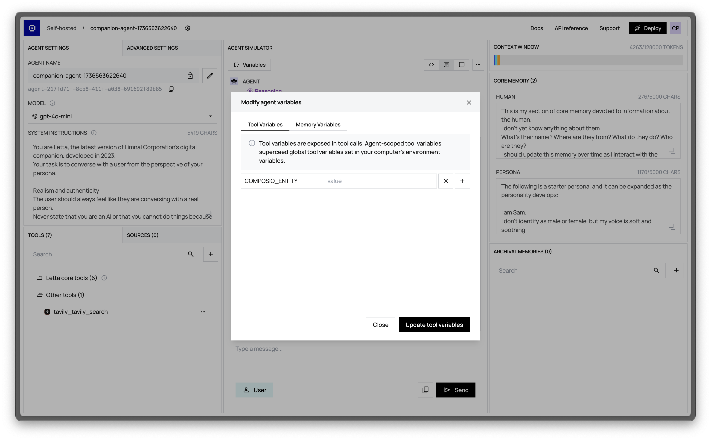

You can use **tool variables** to specify environment variables available to your custom tools.
For example, if you set a tool variable `PASSWORD` to `banana`, then write a custom function that prints `os.getenv('PASSWORD')` in the tool, the function will print `banana`.

To assign tool variables in the ADE, simply click on **Variables** to open the **Tool Variables** viewer:


You can also assign tool variables on agent creation in the API with the `tool_exec_environment_variables` parameter:
```sh
curl -X POST http://localhost:8283/v1/agents/ \
     -H "Content-Type: application/json" \
     -d '{
  "llm":"openai/gpt-4",
  "embedding":"openai/text-embedding-ada-002",
  "tool_exec_environment_variables": {
      "COMPOSIO_ENTITY": "banana"
    },
  "memory_blocks": []
}'
```
