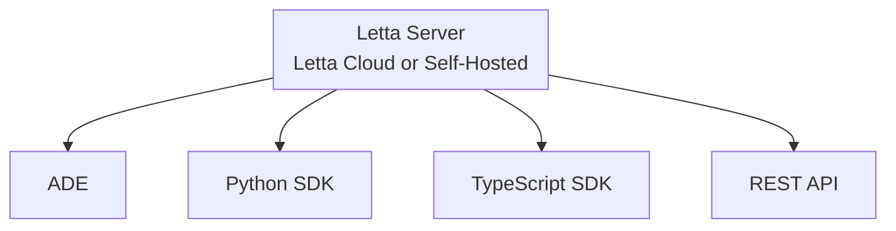

The Letta platform provides multiple ways to interact with your stateful agents. Whether through the ADE's visual interface or programmatically via our APIs, you're always connecting to the same agents running in your Letta server.



## APIs and SDKs

We provide a comprehensive REST API and native SDKs in Python and TypeScript. All three interfaces - the ADE, REST API, and SDKs - use the same underlying API to interact with your agents, making it seamless to develop visually in the ADE and then integrate those agents into your applications.

### Python SDK

```python
from letta import Letta

# connect to a local server
client = Letta(base_url="http://localhost:8283")

# connect to Letta Cloud
client = Letta(token="LETTA_API_KEY")   
```

### TypeScript SDK

```typescript
import { LettaClient} from '@letta-ai/letta-client'

const client = new LettaClient({
    token: "LETTA_API_KEY",
});

```