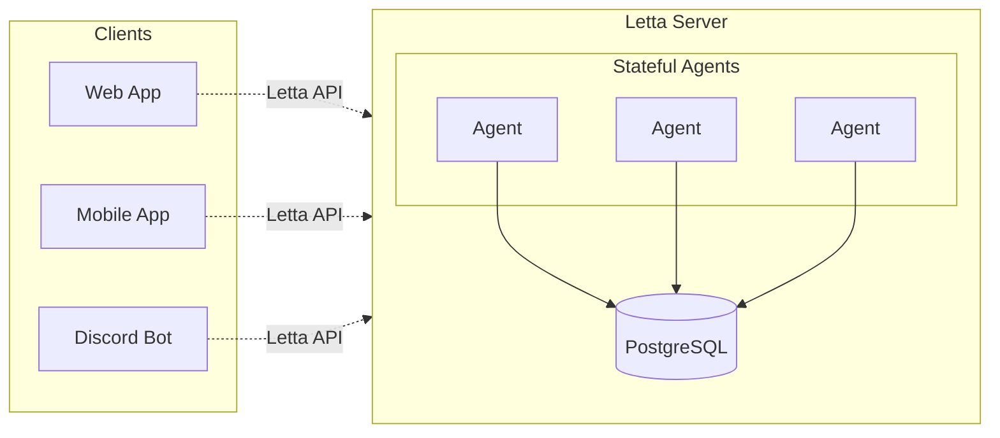

Letta enables developers to build and deploy stateful AI agents - agents that maintain memory and context across long-running conversations. The platform includes our open-source agents framework and all the tools needed to build and deploy agents in production.

## Letta's Stateful Agents
Letta agents are stateful AI systems that evolve and learn over time, maintaining consistent memory and behavior beyond the limitations of traditional LLMs.
The Letta platform brings together a visual development environment (the ADE), production APIs, and a sophisticated server runtime to enable the creation and deployment of stateful agents.

The [Agent Development Environment (ADE)](/agent-development-environment) provides a visual interface for building and monitoring agents, with real-time visibility into agent memory and behavior.

The [Letta API](/api-reference/overview) enables you to deploy agents as production services, with native SDKs for Python and TypeScript applications.

The **Letta Server** manages agent state and persistence through sophisticated context management, enabling agents to learn and improve over time.

## Building with Stateful Agents
Try the [ADE](/agent-development-environment) to see stateful agents in action. The ADE provides complete visibility into your agent's memory, context window, and decision-making process - essential tools for developing and debugging production agent applications.

Our goal is to enable you to build AI applications that go beyond simple chatbots.
With Letta, you can create agents that maintain consistent personalities, learn from past interactions, and integrate with your existing systems through custom tools.

## Context Management for Stateful Agents
LLMs by themselves lack persistent memory and have no way to manage what information they consider when responding. Context management is what enables an LLM to maintain consistent memory and behavior over long periods, just as humans draw on different types of memories and knowledge when having conversations.

Letta's context management system solves this by intelligently managing what information your agent has access to - from its long-term memories to external data sources.
This enables agents to maintain consistent behavior across days or even months of interactions, while automatically incorporating relevant information from large external data sources.

## Building Better Agents with Context Management
Letta's context management system automatically handles the complexity of managing what information your agent has access to.
With Letta, agents can maintain a consistent personality while drawing on relevant memories and external data.

Letta's context management system handles everything from memory prioritization to context window optimization, enabling you to focus on building your agent's capabilities rather than managing its memory.

## Running Agents as Production Services
Unlike traditional LLM agents that run inside of Python scripts, Letta agents run as autonomous services with their own APIs.

Each agent maintains its own state, can be connected to custom tools and data sources, and can be accessed by multiple clients simultaneously. The Letta Server handles all the complexity of managing agent state, persistence, and scaling.

## Where to Run Letta
Depending on your deployment needs, there are two ways to use Letta:

* [Letta Cloud](/guides/cloud): the easiest option - [sign up for early access](https://forms.letta.com/early-access) to our managed service where you can instantly create and deploy agents through the ADE.
* [Self-hosted](/guides/server/quickstart): run the Letta Server on your own infrastructure using Docker or pip. Connect to any LLM provider, from cloud services like OpenAI to local deployments like Ollama.

## Join Our Community
Building something with Letta? Join our [Discord](https://discord.gg/letta) to connect with other developers creating stateful agents and share what you're working on.
