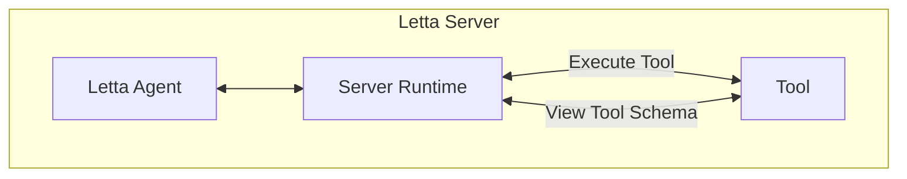
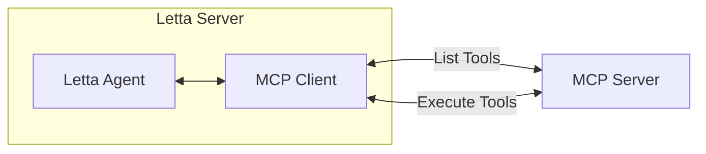
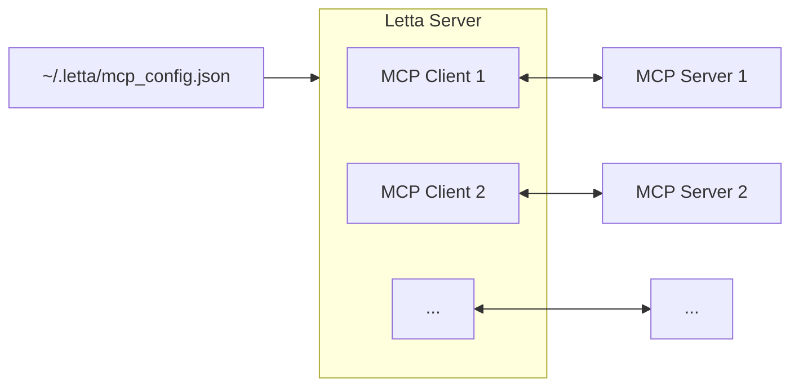
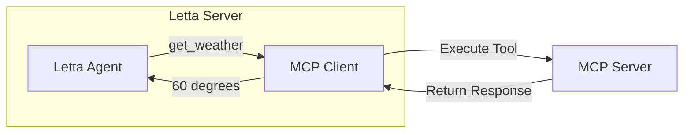

<Tip>
Model Context Protocol (MCP) is a framework for connecting LLMs to tools and data, developed by [Anthropic](https://www.anthropic.com).
To learn more about MCP, visit their [documentation site](https://modelcontextprotocol.io).
</Tip>

**Already know what an MCP server is?** Jump to the Letta [MCP setup guide](/guides/mcp/setup).

## What is an "MCP server"?

Developers can create **MCP servers** to give LLMs / LLM agents an easy way to view and execute tools (to use the MCP server, the agent framework must support acting as an "MCP client").
For example, a developer can create an MCP server for getting the weather using an API service.

When using MCP for tools, the MCP server needs to implement two key functionalities:
1. List the available tools (e.g. `get_weather` and `get_alerts`) and provide the JSON schemas for the tools (which tell the agent how to call the tools)
2. Handle the actual invocation of the tools, given the input arguments generated by the agent

**MCP clients** (like Letta) can then ask this server to list the available tools and execute them.

Simply put, the Letta MCP integration is another means to connect your Letta agents to more tools. More optionality through the power of open source!

## How do regular tools work?

In Letta, the agent can see the available tools as JSON schemas.
When the agent wants to invoke a tool, the agent provides the input arguments to a tool.
The Letta runtime then takes the input arguments from the agent, and attempts to run the tool - if tool execution succeeds, the agent receives the output from the tool, and if the tool fails, the agent receives the output of the error. Because the agent receives an error if the tool execution fails, it allows the agent to attempt to recover from its mistake by trying again.

## How do MCP tools work?

### MCP tool visibility

When the Letta server starts, it reads from the `~/.letta/mcp_config.json` file and attempts to connect to each MCP server listed in the config. If the connection is successful, the Letta server polls the MCP server for a list of tools.

These tools are shown in the ADE editor (where they can also by attached to agents). MCP tools (that were found during Letta server startup) can be attached using the MCP-specific Letta API routes.

### MCP tool execution

With MCP tools in Letta, the tool execution is not handled by the Letta server - instead, the tool execution happens on the MCP server.

This is similar to what happens when you use tool sandboxing (the tool is executed in a sandbox) or when you use Composio tools (the tool is executed on Composio's servers) - with MCP, the tool is always executed by the MCP server.

## Next steps

Now that you know what MCP is, visit our [MCP setup guide](/guides/mcp/setup) to learn how to set up an MCP server to connect MCP tools to a Letta agent.
