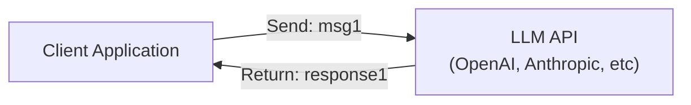
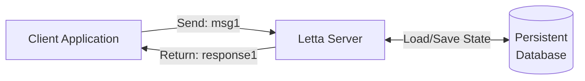
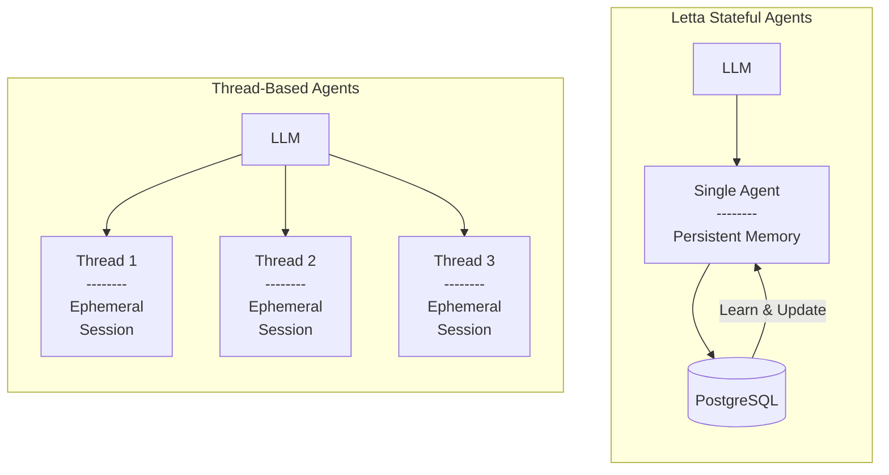

## Stateful vs Stateless APIs

Traditional LLM APIs like OpenAI and Anthropic are **stateless** - they have no memory of previous interactions. Your application must manage all state client-side and send the entire conversation history with every request.

**Letta is fundamentally different.** Letta provides **stateful agents** where state is managed server-side and persisted to a database. You only send new messages, and the server handles memory, context, and conversation history.

### Traditional Stateless API

With stateless APIs, there is no state persistence between requests. The client must send the entire conversation history with every call.



The client must send the full conversation history with each request:
- Request 2: `[msg1, response1, msg2]`
- Request 3: `[msg1, response1, msg2, response2, msg3]`

### Letta Stateful API

Letta maintains agent state on the server and persists it to a database. Clients only send new messages, and the server handles all state management.



The client only sends new messages:
- Request 2: `[msg2]`
- Request 3: `[msg3]`

### Key Differences

| Aspect | Traditional (Stateless) | Letta (Stateful) |
|--------|------------------------|------------------|
| **State management** | Client-side | Server-side |
| **Request format** | Send full conversation history | Send only new messages |
| **Memory** | None (ephemeral) | Persistent database |
| **Context limit** | Hard limit, then fails | Intelligent management |
| **Agent identity** | None | Each agent has unique ID |
| **Long conversations** | Expensive & brittle | Scales infinitely |
| **Personalization** | App must manage | Built-in memory blocks |
| **Multi-session** | Requires external DB | Native support |

### Code Comparison

**Stateless API (e.g., OpenAI):**
```python
# You must send the entire conversation every time
messages = [
    {"role": "user", "content": "Hello, I'm Sarah"},
    {"role": "assistant", "content": "Hi Sarah!"},
    {"role": "user", "content": "What's my name?"},  # ← New message
]

# Send everything
response = openai.chat.completions.create(
    model="gpt-4",
    messages=messages  # ← Full history required
)

# You must store and manage messages yourself
messages.append(response.choices[0].message)
```

**Stateful API (Letta):**
```python
# Agent already knows context
response = client.agents.messages.create(
    agent_id=agent.id,
    messages=[
        {"role": "user", "content": "What's my name?"}  # ← New message only
    ]
)

# Agent remembers Sarah from its memory blocks
# No need to send previous messages
```

## Agents as Services

**Letta treats agents as persistent services, not ephemeral library calls.**

In traditional frameworks, agents are objects that live in your application's memory and disappear when your app stops. In Letta, agents are **independent services** that:
- Continue to exist when your application isn't running
- Maintain state in a database
- Can be accessed from multiple applications simultaneously
- Run autonomously on the server

You interact with Letta agents through REST APIs:
```
POST /agents/{agent_id}/messages
```

This architecture enables:
- **Multi-user applications** - Each user gets their own persistent agent
- **Agent-to-agent communication** - Agents can message each other
- **Background processing** - Agents can continue working while your app is offline
- **Deployment flexibility** - Scale agents independently from your application

## Persistence by Default

In Letta, **all state is persisted automatically**:
- Agent memory (both memory blocks and archival)
- Message history
- Tool configurations
- Agent state and context

Because everything is persisted:
- Agents can be paused and resumed at any time
- You can reload agents across different machines
- State is never lost due to application restarts
- Long conversations don't degrade performance

## Self-Editing Memory

Unlike RAG systems that passively retrieve documents, **Letta agents actively manage their own memory**. Agents use built-in tools to:
- Edit their memory blocks when learning new information
- Insert facts into archival memory for long-term storage
- Search their past conversations when context is needed

This enables agents to:
- Learn user preferences over time
- Maintain consistent personality across sessions
- Build long-term relationships with users
- Continuously improve from interactions

[Learn more about memory →](/guides/agents/memory)

## Agents vs Threads

Letta doesn't have the concept of **threads** or **sessions**. Instead, there are only **stateful agents** with a single perpetual message history.



**Why no threads?** Letta is built on the principle that **all interactions should be part of persistent memory**, not ephemeral sessions. This enables:
- Continuous learning across all conversations
- True long-term memory and relationships
- No context loss when "starting a new thread"

For multi-user applications, we recommend **creating one agent per user**. Each agent maintains its own persistent memory about that specific user.

If you need conversation templates or starting points, use [agent templates](/guides/cloud/templates) to create new agents with pre-configured state.

## LLM OS

The **LLM Operating System** is the infrastructure layer that manages agent execution, state, and memory. This includes:
- **Agent runtime** - Manages tool execution and the reasoning loop
- **Memory layer** - Handles context window management and persistence
- **Stateful layer** - Coordinates state across database, cache, and execution

Letta's architecture is inspired by the [MemGPT research paper](https://arxiv.org/abs/2310.08560), which introduced these concepts.

## Next Steps

<CardGroup cols={2}>
  <Card
    title="Build Your First Agent"
    href="/quickstart"
  >
    Create a stateful agent with the Letta API
  </Card>
  <Card
    title="Understanding Memory"
    href="/guides/agents/memory"
  >
    Learn how agents manage their memory
  </Card>
  <Card
    title="Agent Overview"
    href="/guides/agents/overview"
  >
    Deep dive into Letta's agent architecture
  </Card>
  <Card
    title="MemGPT Research"
    href="/concepts/memgpt"
  >
    Read about the research behind Letta
  </Card>
</CardGroup>
