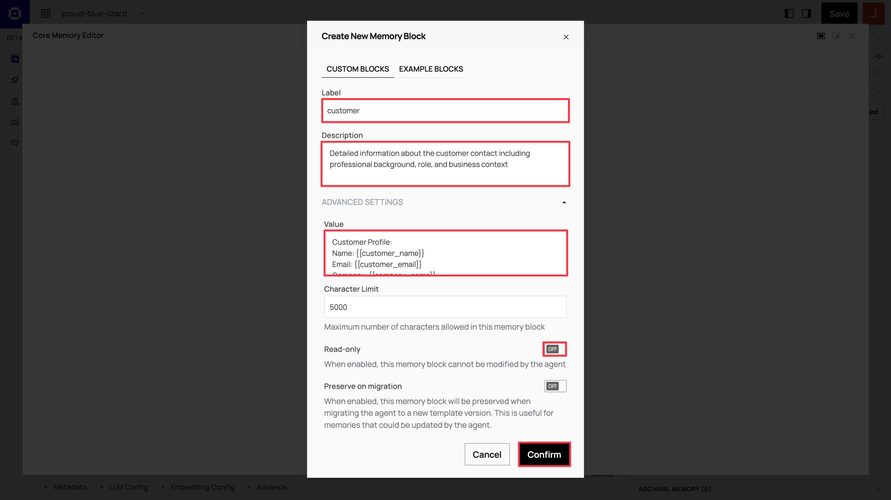
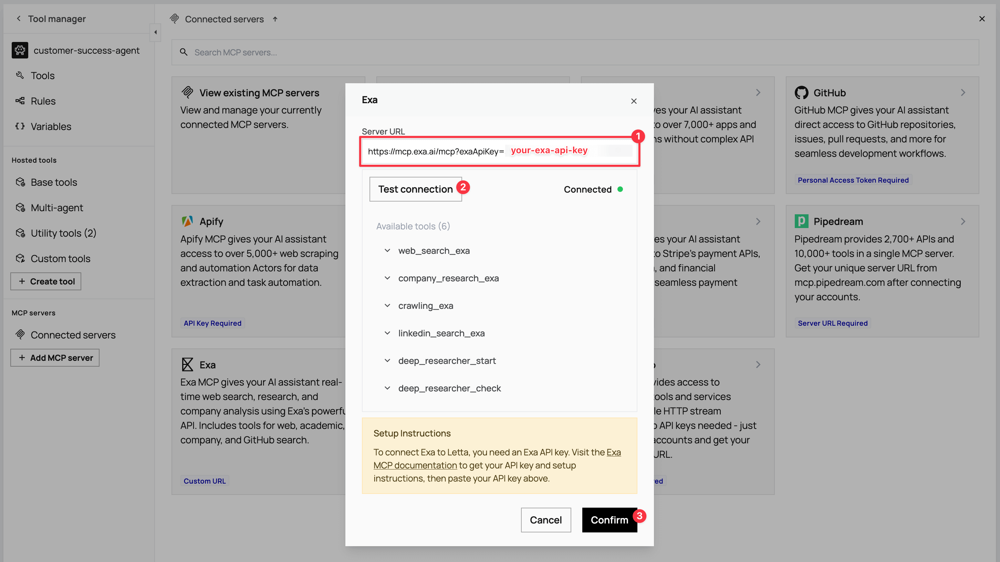

<Frame>
<iframe width="560" height="315" src="https://www.youtube.com/embed/PLACEHOLDER_VIDEO_ID" title="YouTube video player" frameborder="0" allow="accelerometer; autoplay; clipboard-write; encrypted-media; gyroscope; picture-in-picture; web-share" referrerpolicy="strict-origin-when-cross-origin" allowfullscreen></iframe>
</Frame>

Companies generally have customer success agents that handle dozens or even hundreds of accounts. This is a natural pattern to follow when building out AI-based agents too.

But what if each of your customers had their own dedicated customer success agent that autonomously researched their background and reached out with personalized communications?

This guide shows you how to programmatically create customer-specific agents using the Letta SDK. Instead of manually setting up agents through a UI, we'll build an automated workflow that creates a dedicated agent for each customer who signs up for your application. When a customer signs up, their agent immediately springs into action: researching their LinkedIn profile, investigating their company, and sending a personalized welcome email—all without human intervention. This approach positions Letta as a lightweight CRM alternative or as a way to augment your existing CRM with AI-powered relationship management.

We'll build a customer sign-up application that demonstrates two key capabilities: autonomous agent action and ongoing conversation. When someone signs up, their dedicated agent immediately researches their professional background using web search tools, updates its memory with findings, drafts a personalized welcome email based on its research, and sends it automatically. After this proactive outreach, the agent remains available through a chat interface for ongoing customer conversations.

<Note>
We'll use the [ADE](/agent-development-environment) to create the agent template in a UI, then use the [Letta API / SDK](/api-reference/overview) to programmatically create agents from that template whenever a new customer signs up.
</Note>

## Prerequisites

To follow along, you need:

- **[Node.js](https://nodejs.org/):** Version 16 or higher to run the application
- **[Git](https://git-scm.com/):** To clone the starter code repository
- **[Letta](https://www.letta.com):** To access the agent development platform and API
- **[Gmail](https://gmail.com):** To configure the agent's email sending capability
- **[Zapier MCP](https://mcp.zapier.com/mcp):** To set up the MCP email tool integration
- **[Exa](https://exa.ai):** To configure MCP research and LinkedIn lookup tools

## Step 1: Create an agent template

Agent templates serve as blueprints that define your agent's memory structure, tools, and behavior patterns. We'll configure our template with web research and email tools so agents can autonomously research customers and send personalized communications. You'll use the Agent Development Environment (ADE) to build and configure your template.

### Create a new template

From the Letta dashboard, you'll create a new template and configure it in the Agent Development Environment (ADE).

<AccordionGroup>
<Accordion title="The complete template creation process">
<Steps>
  <Step title="Create a new template">
    From the Letta dashboard, click **Templates** → **+ New template** → **Start from scratch**.

    
  </Step>
  <Step title="Explore the Agent Development Environment">
    The ADE interface has three key areas: a center chat simulator for testing, a left sidebar for configuration (template settings, tools, LLM config), and a right panel showing memory architecture with real-time context utilization.

    
  </Step>
  <Step title="Name your template">
    Rename your template `customer-success-agent` by clicking the **pen icon** next to the **Name** field.

    
  </Step>
</Steps>
</Accordion>
</AccordionGroup>

### Set up memory blocks

Memory blocks create your agent's persistent knowledge architecture. In the ADE's right panel, in the **Core Memory** section, click **Advanced** → **+ New block** to add custom memory blocks.



Create four core memory blocks with the following configurations:

<AccordionGroup>
<Accordion title="Customer block: Customer profile and context">
<Steps>
<Step title="Create the memory block">
**Label**: `customer`

**Description**:
```
Detailed information about the customer contact including professional background, role, and business context
```

**Value**:
```
Customer Profile:
Name: {{customer_name}}
Email: {{customer_email}}
Company: {{company_name}}
Title: {{job_title}}
Industry: {{industry_sector}}

Professional Background:
{{professional_background}}

Business Challenges:
{{business_challenges}}

Communication Preferences:
{{communication_preferences}}
```

The `customer` memory block stores everything your agent learns about the individual customer contact. Template variables are populated when creating agents from this template, while research findings accumulate in descriptive fields.
</Step>
</Steps>
</Accordion>

<Accordion title="Organization block: Company knowledge base">
<Steps>
<Step title="Create the memory block">
**Label**: `organization`

**Description**:
```
ACME Manufacturing's company information, products, and value propositions for reference
```

**Read-only**: Yes

**Value**:
```
ACME Manufacturing - Industrial Automation Solutions

Key Products:
• QualityCheck AI: Real-time quality control system (reduces defects by 30%)
• SupplyOptimize: Supply chain optimization platform (20% cost savings)
• ProductionFlow: Manufacturing workflow automation

Target Industries: Automotive, Aerospace, Electronics, Medical Devices
Company Size Focus: 100-1000 employees

Value Propositions:
- Reduce manufacturing defects by 25-40%
- Optimize supply chain costs by 15-25%
- Improve production efficiency by 20-35%
- Seamless ERP integration

Competitive Advantages:
- Industry-specific AI models trained on manufacturing data
- 99.7% uptime SLA with 24/7 support
- ROI typically achieved within 6 months

Contact Information:
- Representative: [Your Name]
- Title: [Your Title]
```

The `organization` memory block contains static company information that agents reference but shouldn't modify. Set as read-only to ensure consistent messaging across all customer interactions.

<Note>
Replace the bracketed placeholders with your actual name and title so the agent sends emails with proper sender identification.
</Note>
</Step>
</Steps>
</Accordion>

<Accordion title="Tool use guidelines block: Research and communication guidelines">
<Steps>
<Step title="Create the memory block">
**Label**: `tool_use_guidelines`

**Description**:
```
Instructions for effective tool usage and customer research methodology
```

**Read-only**: Yes

**Value**:
```
Research Strategy:
1. Begin with LinkedIn research to understand the contact's professional background
2. Use web search to research the customer's company, recent news, and industry challenges
3. Focus on identifying specific use cases for ACME Manufacturing's solutions
4. Look for relevant business triggers (growth, challenges, new initiatives)

Communication Guidelines:
- Personalize emails based on research findings
- Reference specific company challenges or industry trends
- Connect ACME products to customer's likely pain points
- Maintain professional but approachable tone
- Include relevant case studies or statistics when appropriate

Tool Usage Best Practices:
- Use company_research_exa for comprehensive business intelligence
- Use linkedin_search_exa for professional background verification
- Draft emails with research context before sending
- Update memory blocks with key findings after each research session
```

The `tool_use_guidelines` memory block contains instructions for how your agent should use its research and communication tools effectively.
</Step>
</Steps>
</Accordion>

<Accordion title="Tasks block: Action items and objectives">
<Steps>
<Step title="Create the memory block">
**Label**: `tasks`

**Description**:
```
Current objectives, action items, and next steps for this customer relationship
```

**Value**:
```
Current Priorities:
1. Complete customer and company research
2. Identify specific use cases for ACME products
3. Draft personalized welcome email
4. Schedule discovery call
5. Prepare customized demo materials

Research Checklist:
- [] LinkedIn professional background research
- [] Company website and recent news analysis
- [] Industry-specific challenge identification
- [] Competitive landscape assessment
```

The `tasks` memory block contains specific customer onboarding tasks like research, email drafting, and discovery call scheduling with a checklist to track completion.
</Step>
</Steps>
</Accordion>

<Accordion title="Template variables">
<Steps>
<Step title="Understand template variables">
The `{{variable_name}}` placeholders in the `customer` memory block are populated with actual customer data when you create agents from the template. These variables will be filled programmatically via the SDK when creating agents in the application code.
</Step>
</Steps>
</Accordion>
</AccordionGroup>

### Configure MCP tools for customer research

Tools transform your agent from a static responder into an active researcher that can autonomously gather information and take action. In the ADE's left sidebar, click **Tools** → **Tool Manager**. This opens a modal where you'll configure Model Context Protocol (MCP) servers that provide external capabilities.


Your agent needs research tools to look up customer backgrounds and company information, plus email tools to draft and send personalized welcome messages automatically.

<AccordionGroup>
<Accordion title="Add Exa for research tools">
<Steps>
<Step title="Configure Exa MCP server">
Exa provides web search, company research, and LinkedIn lookup capabilities for your agent.

1. In the **Tool manager** sidebar, click **+ Add MCP server** in the **MCP servers** section. Select **Exa** from the list to open the configuration modal.

2. Go to [exa.ai](https://exa.ai) to create an account. Then visit [dashboard.exa.ai/api-keys](https://dashboard.exa.ai/api-keys) to copy your default secret key.

   

3. Paste the [Exa MCP server URL](https://docs.exa.ai/reference/exa-mcp#remote-exa-mcp) `https://mcp.exa.ai/mcp?exaApiKey=your-exa-api-key` in the Server URL field on the modal. Replace `your-exa-api-key` with your Exa secret key and click **Test connection**. When connected, the modal displays a list of available tools, including `web_search_exa`, `company_research_exa`, and `linkedin_search_exa`. Click **Confirm** to add the server.

   
</Step>
</Steps>
</Accordion>

<Accordion title="Add Zapier for email tools">
<Steps>
<Step title="Configure Zapier MCP server">
Zapier provides Gmail integration for drafting and sending personalized emails.

1. Click **+ Add MCP server** again and select **Zapier**. For the API setup, go to [mcp.zapier.com/mcp](https://mcp.zapier.com/mcp), create an account, then click **+ New MCP Server** in your Zapier dashboard.

   

2. Choose **Other** from the **MCP Client** options and name it `Email sender`. After creating the server, click **+ Add tool**, select **Gmail** from the modal, and add the Gmail tools. Connect your Gmail account for sending emails.

   

3. In your Zapier dashboard, click **Connect** in the top toolbar and copy the **Server URL**.

   

4. Return to the Letta modal, paste the server URL in the Server URL field, and test the connection. When you see the Gmail tools appear, click **Confirm**.

   
</Step>
</Steps>
</Accordion>

<Accordion title="Attach tools to your agent">
<Steps>
<Step title="Connect tools to the template">
In the **Tool manager** view, you can now see both MCP servers. Click each server to view the available tools. To attach them, click the **link icon** next to the tools your agent needs:


**From Exa**: Attach `web_search_exa`, `company_research_exa`, and `linkedin_search_exa`.

**From Zapier**: Attach `gmail_create_draft` and `gmail_send_email`.
</Step>
</Steps>
</Accordion>
</AccordionGroup>

### Save your template

Once you've configured all memory blocks and tools, save your template to make it available for programmatic agent creation.

<AccordionGroup>
<Accordion title="Save and version your template">
<Steps>
<Step title="Save the template">
Click the **Save** button in the ADE toolbar. This opens a version modal. Click **Save new version** to save your template for agent creation.

Your `customer-success-agent` template is now ready to create customer-specific agents programmatically via the SDK.
</Step>
</Steps>
</Accordion>
</AccordionGroup>

## Step 2: Set up the application and install the Letta SDK

Now that we have our agent template configured, we'll set up a customer sign-up application and integrate it with the Letta SDK. We've prepared a starter application that handles user registration and includes a chat interface.

<Note>
You can view the complete implementation at any time by switching to the `complete-app` branch.
</Note>

<AccordionGroup>
<Accordion title="Clone and explore the starter application">
<Steps>
<Step title="Clone the repository and install dependencies">
Clone the starter repository and install dependencies:

```bash
git clone https://github.com/ritza-co/letta-customer-specific-agents-starter.git
cd letta-customer-specific-agents-starter
npm install
```

The starter application includes:

- **Sign-up flow**: Collects customer name, email, company, and job title
- **Login system**: Email-based authentication
- **Chat interface**: A placeholder chatbot that echoes messages
- **User storage**: JSON-based persistence in `users.json`
</Step>

<Step title="Start and test the application">
Start the application to verify everything works:

```bash
npm start
```

Open `http://localhost:3000` in your browser. Click **Sign Up** and create a test account. After signing up, you'll be redirected to the chat interface. Try sending a message – the chatbot will echo it back. This echo behavior is a placeholder that we'll replace with Letta agent integration.


</Step>

<Step title="Understand the application structure">
The application structure looks like this:

```
customer-success-crm-starter/
├── server.js              # Express server with API routes
├── public/
│   ├── index.html         # Homepage with login form
│   ├── signup.html        # Sign-up form
│   ├── chat.html          # Chat interface
│   └── style.css          # Styling
├── users.json             # User data storage (auto-generated)
└── package.json           # Dependencies
```

The `server.js` file contains four API endpoints:

- `POST /api/signup` – Creates new user accounts
- `POST /api/login` – Authenticates users by email
- `GET /api/user/:userId` – Retrieves user information
- `POST /api/chat` – Handles chat messages (currently echoes)
</Step>
</Steps>
</Accordion>
</AccordionGroup>

With the starter application running, we're ready to install the Letta SDK and integrate it to automatically create agents for each new user.

Install the Letta SDK and dotenv for environment variable management:

```bash
npm install @letta-ai/letta-client dotenv
```

This installs:
- **@letta-ai/letta-client** – The official Letta SDK for Node.js
- **dotenv** – Loads environment variables from a `.env` file

Create a `.env` file in the project root:

```bash
touch .env
```

Open `.env` and add your Letta API configuration:

```
LETTA_API_KEY=your_letta_api_key_here
LETTA_TEMPLATE_VERSION=your_project/customer-success-agent:latest
```

To get your Letta API key, navigate to [app.letta.com/api-keys](https://app.letta.com/api-keys) in your browser. Click **+ Create API key**, name it (for example, `CRM Integration`), and copy the key value.

For the `LETTA_TEMPLATE_VERSION`, you need the template identifier from your Letta dashboard. Navigate to **Templates** in the Letta dashboard and click on your `customer-success-agent` template. The template version follows the format `{project_slug}/{template_name}:{version}`. For example, if your project slug is `default-project`, the value would be:

```
LETTA_TEMPLATE_VERSION=default-project/customer-success-agent:latest
```

<Note>
If you're unsure of your project slug, check the URL in your browser when viewing the template in the Letta dashboard. The slug typically appears in the path.
</Note>

Now initialize the Letta SDK in `server.js`. First, add the dotenv import at the very top of the file (before the existing imports):

```javascript
require('dotenv').config();
```

Then, add the Letta client import after the `path` import:

```javascript
const { LettaClient } = require('@letta-ai/letta-client');
```

Finally, add the Letta client initialization after the `USERS_FILE` constant declaration:

```javascript
// Initialize Letta client
const lettaClient = new LettaClient({
    token: process.env.LETTA_API_KEY,
});
```

The `LettaClient` instance connects to the Letta API using your API key. We'll use this client throughout the application to create identities, create agents, and send messages.

## Step 3: Create identities on signup

When a customer signs up, we need to create a Letta identity for them. An identity represents a unique user in the Letta system and serves as the foundation for creating dedicated agents. The identity-agent relationship enables proper multi-user isolation – each customer gets their own identity, and each identity can have one or more agents associated with it.

We'll modify the signup endpoint to create agents in the background while allowing users to proceed immediately. This prevents signup delays while agent creation completes asynchronously.

In the `POST /api/signup` endpoint, find the `newUser` object (around line 60) and add three new fields to track agent creation:

```javascript
const newUser = {
    id: Date.now().toString(),
    name,
    email,
    company,
    role,
    agentId: null,                      // Add this
    identityId: null,                   // Add this
    agentStatus: 'creating',            // Add this
    createdAt: new Date().toISOString()
};
```

Add this code after the `res.json()` call (before the closing `} catch` block) to trigger background agent creation:

```javascript
// Create agent asynchronously in background (don't await)
createAgentForUser(newUser.id, name, email, company, role).catch(error => {
    console.error(`Failed to create agent for user ${newUser.id}:`, error);
});
```

This approach creates the user account immediately and returns a success response, then triggers background agent creation without blocking the signup flow.

Now add the background function that handles identity and agent creation. Add this function after the signup endpoint (before the login endpoint):

```javascript
// Background function to create agent
async function createAgentForUser(userId, name, email, company, role) {
    try {
        console.log(`[Background] Creating identity for ${name}...`);
        const identity = await lettaClient.identities.create({
            identifierKey: `customer_${Date.now()}`,
            name: name,
            identityType: "user"
        });
        console.log(`[Background] Identity created with ID: ${identity.id}`);

        // Agent creation will go here in Step 4

        // Update user with identity and agent info
        const users = await readUsers();
        const userIndex = users.findIndex(u => u.id === userId);
        if (userIndex !== -1) {
            users[userIndex].identityId = identity.id;
            users[userIndex].agentStatus = 'ready';
            await writeUsers(users);
        }
    } catch (error) {
        console.error(`[Background] Error creating agent for user ${userId}:`, error);

        // Update user status to error
        const users = await readUsers();
        const userIndex = users.findIndex(u => u.id === userId);
        if (userIndex !== -1) {
            users[userIndex].agentStatus = 'error';
            await writeUsers(users);
        }
    }
}
```

The `identifierKey` uses a timestamp to ensure uniqueness. In a production application, you might use UUIDs or identifiers from your existing CRM system.

The background function creates the identity and updates the user record with the identity ID. In the next step, we'll add the agent creation logic.

## Step 4: Create agents from the template

With the identity created, we can now create a dedicated agent from our `customer-success-agent` template. The template-based approach creates a fully-configured agent with all memory blocks, tools, and settings in a single API call.

Update the `createAgentForUser` function to add agent creation after identity creation. Replace the `// Agent creation will go here in Step 4` comment with:

```javascript
console.log(`[Background] Creating Letta agent from template for ${name}...`);
let agent;
const templateVersion = process.env.LETTA_TEMPLATE_VERSION;

if (templateVersion) {
    console.log(`[Background] Using template: ${templateVersion}`);
    const [project, templateNameVersion] = templateVersion.split('/');

    const response = await lettaClient.templates.createagentsfromtemplate(project, templateNameVersion, {
        identityIds: [identity.id],
        memoryVariables: {
            customer_name: name,
            customer_email: email,
            company_name: company,
            job_title: role
        }
    });

    agent = response.agents[0];
} else {
    console.log(`[Background] No template configured, creating agent manually...`);
    agent = await lettaClient.agents.create({
        memoryBlocks: [
            {
                label: "customer",
                value: `Customer Profile:
Name: ${name}
Email: ${email}
Company: ${company}
Title: ${role}

Professional Background:
[To be researched and updated by the agent]

Business Challenges:
[To be identified through conversations]

Communication Preferences:
[To be learned over time]`
            },
            {
                label: "persona",
                value: "I am a dedicated customer success agent. My role is to help customers get the most value from our product, understand their needs, and provide personalized support. I should be professional, helpful, and proactive in identifying opportunities to assist."
            }
        ],
        model: "openai/gpt-4o-mini",
        embedding: "openai/text-embedding-3-small",
        identityIds: [identity.id]
    });
}

console.log(`[Background] Agent created with ID: ${agent.id}`);
```

The code checks if `LETTA_TEMPLATE_VERSION` is configured. If it is, the agent is created from your template with memory variables populated from the signup form. The template version string (like `default-project/customer-success-agent:latest`) is split into the project slug and template name:version components that the SDK expects.

The `memoryVariables` object maps signup form data to the template variables we defined in Step 1. The agent's `customer` memory block will have these values populated in place of the `{{variable_name}}` placeholders. Fields like `professional_background` and `business_challenges` remain empty – the agent will research and populate these using its tools.

If no template is configured, the code falls back to manual agent creation with basic memory blocks. This fallback won't include the research tools or additional memory blocks from your template, but it allows testing without template configuration.

Now update the section that saves the agent information to the user record. Find the comment `// Update user with identity and agent info` and replace that entire block with:

```javascript
// Update user with identity and agent info
const users = await readUsers();
const userIndex = users.findIndex(u => u.id === userId);
if (userIndex !== -1) {
    users[userIndex].agentId = agent.id;
    users[userIndex].identityId = identity.id;
    users[userIndex].agentStatus = 'ready';
    await writeUsers(users);
}
```

The agent is now fully created and linked to the customer's identity. Next, we'll send an initial prompt to activate the agent and have it begin researching the customer.

After the user update code, add this code to send the initial research prompt:

```javascript
// Send initial prompt to agent for research and welcome email
console.log(`[Background] Sending initial research prompt to agent...`);
try {
    await lettaClient.agents.messages.create(agent.id, {
        messages: [{
            role: "system",
            content: `You are a customer success agent assigned exclusively to ${name} (${email}) at ${company}. They are a ${role}. From this point forward, all messages you receive will be from ${name} unless otherwise specified.

Your first task: Research ${name}'s background on LinkedIn and their company through search, update your customer memory block with key findings, draft a personalized welcome email based on your research that connects ACME's automation solutions to their manufacturing challenges, and send the email immediately.`
        }]
    });
    console.log(`[Background] Initial agent prompt sent successfully`);
} catch (promptError) {
    console.error(`[Background] Warning: Could not send initial prompt:`, promptError.message);
}
```

This initial prompt triggers autonomous agent behavior. The agent will:
1. Use the `linkedin_search_exa` tool to research the customer's professional background
2. Use the `company_research_exa` tool to investigate their company and industry
3. Update its `customer` memory block with findings
4. Use `gmail_create_draft` to compose a personalized welcome email incorporating research insights
5. Use `gmail_send_email` to send the email immediately

The agent completes this entire workflow without human intervention. The customer receives a personalized welcome email within minutes of signing up, demonstrating how agents can provide value before any direct conversation begins. After sending the email, the agent remains available through the chat interface for ongoing interactions.

## Step 5: Integrate the chat endpoint with Letta agents

The final integration step replaces the placeholder echo chatbot with real Letta agent communication. Each user's messages will be sent to their dedicated agent, and the agent's responses will be displayed in the chat interface.

Find the `POST /api/chat` endpoint in `server.js` and replace the entire endpoint with:

```javascript
app.post('/api/chat', async (req, res) => {
    try {
        const { userId, message } = req.body;

        if (!userId || !message) {
            return res.status(400).json({ error: 'User ID and message are required' });
        }

        const users = await readUsers();
        const user = users.find(u => u.id === userId);

        if (!user) {
            return res.status(404).json({ error: 'User not found' });
        }

        if (!user.agentId) {
            return res.status(400).json({ error: 'No agent associated with this user' });
        }

        // Send message to the user's dedicated Letta agent
        console.log(`Sending message to agent ${user.agentId} from identity ${user.identityId}...`);

        const agentResponse = await lettaClient.agents.messages.create(user.agentId, {
            messages: [
                {
                    role: 'user',
                    content: message,
                    senderId: user.identityId  // Link message to the user's identity
                }
            ]
        });

        // Extract the assistant's response from the messages
        let responseText = '';
        for (const msg of agentResponse.messages) {
            if (msg.messageType === 'assistant_message') {
                responseText = msg.content;
                break;
            }
        }

        res.json({
            success: true,
            response: responseText || 'I received your message but need a moment to formulate a response.'
        });
    } catch (error) {
        console.error('Chat error:', error);
        res.status(500).json({
            error: 'Server error',
            details: error.message
        });
    }
});
```

The endpoint now sends each message to the user's dedicated agent via `lettaClient.agents.messages.create()`. The `senderId` parameter links the message to the user's identity, which enables proper user attribution in Letta's system and allows the agent to track which customer is sending each message.

Agent responses can contain multiple messages – function call results, internal reasoning, and the final assistant message. We loop through the response messages to find the one with `messageType: 'assistant_message'`, which contains the text that should be displayed to the user.

The endpoint includes validation to check that the user exists and has an associated agent. If agent creation is still in progress (from Step 3's background function), the error message indicates that no agent is available yet.

## Step 6: Test the application

With all integrations complete, restart the server to test the full workflow:

```bash
npm start
```

Open `http://localhost:3000` in your browser and click **Sign Up**. Fill in the form with your own details – use your real name, email, company, and job title. The agent will research this information and send you an email, so using real data provides the most realistic testing experience.

After clicking **Sign Up**, you'll be redirected to the chat interface immediately. The signup completes instantly while agent creation and autonomous research happen in the background. Watch your terminal output – you should see logs showing the identity creation, agent creation, and initial prompt delivery:

```
[Background] Creating identity for John Doe...
[Background] Identity created with ID: abc-123...
[Background] Creating Letta agent from template for John Doe...
[Background] Using template: default-project/customer-success-agent:latest
[Background] Agent created with ID: agent-456...
[Background] Initial agent prompt sent successfully
```

Once you see "Initial agent prompt sent successfully," your agent is researching your background and drafting a welcome email. Check your email inbox – within a few minutes, you should receive a personalized welcome message from your agent that references your professional background and company context.

The welcome email demonstrates the agent's autonomous research capabilities. It will mention specific details about your role, company, or industry that it discovered through LinkedIn and web search.

After receiving the email, return to the chat interface and send a message like "Hi, what do you know about me?" The agent will respond with information from its memory, including details it gathered during its research. The agent maintains context across the conversation and remembers everything from its initial research.

To verify persistence, log out and log back in using your email. The agent remembers your previous conversation and maintains its memory across sessions.

<Success>
You've built a customer success CRM that automatically creates dedicated AI agents for each customer. Each agent autonomously researches customer backgrounds, sends personalized welcome emails, maintains persistent memory, and provides individualized support through an ongoing chat interface.
</Success>

## What's next?

You've built a working customer success system with programmatic agent creation. Here are ways to scale this into a production CRM or integrate it with your existing customer relationship tools:

<AccordionGroup>
<Accordion title="Integrating with existing CRM systems">
Connect your application to CRM platforms like HubSpot, Salesforce, or Pipedrive using webhooks. When a new contact is created in your CRM, automatically trigger agent creation:

```javascript
app.post('/webhook/crm-contact-created', async (req, res) => {
    const { name, email, company, title } = req.body;

    // Create identity and agent automatically
    createAgentForUser(null, name, email, company, title);

    res.json({ success: true });
});
```

This approach augments your CRM with AI-powered relationship management – each customer gets a dedicated agent that researches their background, maintains conversation history, and provides personalized support. The agent can update the CRM with insights from conversations, qualifying leads and tracking engagement automatically.
</Accordion>

<Accordion title="Forward customer emails to agents using Zapier integration">
Set up automatic email forwarding so your agents can handle ongoing customer communications beyond the initial welcome. When customers reply to emails or send new messages, Zapier can route them to their dedicated agents, allowing the agents to update their memory with new information, draft contextual responses based on conversation history, and maintain personalized interactions across multiple touchpoints. This transforms your agents from one-time onboarding tools into continuous relationship managers.

<Note>
The [Letta-Zapier integration](https://zapier.com/developer/public-invite/227319/7256d6a770965fa8f67ca718244356ff/) is currently in development and available for early testing. The integration is being reviewed by Zapier for public release.
</Note>
</Accordion>

<Accordion title="Deploying to production">
For production deployments, replace the JSON file storage with a database (PostgreSQL, MySQL, or MongoDB) to handle concurrent access and larger user bases. Implement a queue system (like BullMQ or AWS SQS) for agent creation to handle spikes in signups and provide retry logic for failed agent creation attempts.

Add monitoring and logging using services like Datadog or CloudWatch to track agent creation success rates, response times, and API errors. Store API keys and template versions in environment variables using a secrets manager like AWS Secrets Manager or HashiCorp Vault.

Consider implementing template versioning to upgrade all customer agents when you improve your agent template. The Letta SDK supports programmatic template updates that can migrate existing agents to new template versions.
</Accordion>
</AccordionGroup>

**Other possibilities to explore:**
- Agents that schedule meetings and manage follow-ups automatically
- Integration with support ticket systems for context-aware assistance
- Analytics dashboards that track relationship progression and agent effectiveness
- Multi-channel support (Slack, Discord, SMS) for customer communications

The combination of programmatic agent creation, persistent memory, and research tools provides a foundation for building sophisticated customer relationship systems that scale. This approach positions Letta as a lightweight alternative to traditional CRMs or as an intelligent layer on top of existing customer data platforms.
