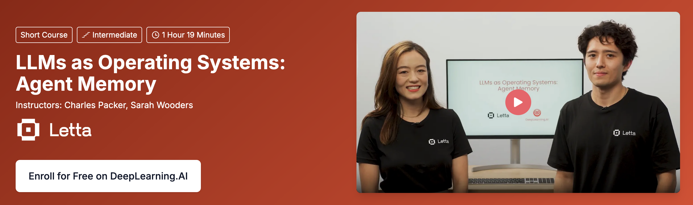

<CardGroup cols={3}>
  <Card
    title="Getting started"
    icon="fa-solid fa-alien-8bit"
    href="/quickstart"
  >
    Create your first Letta agent in a few minutes. 
  </Card>
  <Card
    title="Guides and concepts"
    icon="fa-solid fa-user-astronaut"
    href="/introduction"
  >
    Understand the basics of building stateful agents with long-term memory.
  </Card>
  <Card
    title="Agent Development Environment"
    icon="fa-solid fa-computer-classic"
    href="/agent-development-environment"
  >
    Learn how to use the Agent Development Environment (ADE).
  </Card>
  <Card
    title="API reference"
    icon="fa-solid fa-code"
    href="/api-reference"
  >
    Integrate Letta into your application with a few lines of code.
  </Card>
  <Card
    title="Release notes" 
    icon="fa-solid fa-square-rss"
    href="https://www.letta.com/news"
  >
    Stay up to date with the latest from the Letta. 
  </Card>
  <Card
    title="DeepLearning.AI course" 
    icon="fa-solid fa-graduation-cap"
    href="https://www.deeplearning.ai/short-courses/llms-as-operating-systems-agent-memory"
  >
    Enroll for free on DeepLearning.AI
  </Card>
  
</CardGroup>

  

  

